# 15 Project 2: Interactive Full-Stack Application
This repository is for group 8's Project2 - Interactive Full-Stack Application: 'Feedster'. The main purpose of this project to build a fullstack web application from scratch as a group. This app will execute a design that solves a real-world problem.

## Project Team Authors
<table>
<thead>
<tr>
<th><a href="https://github.com/DavidTunnell">David Tunnell</a></th>
<th><a href="https://github.com/jnordan132">Jacob Nordan</a></th>
<th><a href="https://github.com/ilelandhayes">Leland Hayes</a></th>
<th><a href="https://github.com/DionneNoellaBarretto">Dionne Noella Barretto</a></th>
</tr>
</thead>
<tbody>
<tr>
<td><a target="_blank" rel="noopener noreferrer" href="https://davidtunnell.github.io/my-web-portfolio/"></a></td>
<td><a target="_blank" rel="noopener noreferrer" href="https://jnordan132.github.io/Web-Portfolio-2/"></a></td>
<td><a target="_blank" rel="noopener noreferrer" href="https://ilelandhayes.github.io/Portfolio-Page/"></a></td>
<td><a target="_blank" rel="noopener noreferrer" href="https://dionnenoellabarretto.github.io/DionneNoellaBarretto_Portfolio/"></a></td>
</tr>
</tbody>
</table>

## Project Resources:
<!-- 👉[Watch - Project App Demo]()<br/> -->
👉[Project Live URL (Heroku)](https://feedster-twitter-feed.herokuapp.com/)<br/>
👉[Project Wireframe/Plan/Proposal](https://docs.google.com/presentation/d/12Ssp54Pa-8JnnrAwpo0s94ohWYoS_NhuVFpAaEvPIOY/edit?usp=sharing)<br/>
👉[Project Presentation Deck](https://docs.google.com/presentation/d/1mRIDBl0DP-tDFZV7GiqyeLykqNoXN9z3CVnP8862yow/edit?usp=sharing)<br/>
👉[Database Schema](./public/assets/database-schema.png)
 <br> <br/>


## Feedster Motivation:
 On all social media platforms a user has the ability to follow several different accounts that post about the same interest, but are they able to put all those account postings into one category to see the most relevant information at hand? **NO**. 
 👉 This was the motivation behind 'Feedster', giving the user the ability to have multiple account feeds/postings about a specific category they passionately like to follow, but **all in one place**. 


## User Story
```
AS a user (for example: millennials and beyond or basically any one with an internet connected device) I 
WANT to subscribe to twitter feeds for a specific topic/category 
SO AS to view a mix of content on my account page that others can follow along to keep up with what I keep track of/like to read.
```

## Project Requirements

Apply everything we’ve learnt over the past six units to create a real-world full-stack application that we'll showcase to potential employers. Besides the user story and acceptance criteria our project fulfils the following requirements:
```
✔️ Use Node.js and Express.js to create a RESTful API.
✔️ Use Handlebars.js as the template engine.
✔️ Use MySQL and the Sequelize ORM for the database.
✔️ Have both GET and POST routes for retrieving and adding new data.
✔️ Use at least one new library, package, or technology that we haven’t discussed.
✔️ Have a folder structure that meets the MVC paradigm.
✔️ Include authentication (express-session and cookies).
✔️ Protect API keys and sensitive information with environment variables.
✔️ Be deployed using Heroku (with data).
✔️ Have a polished UI.
✔️ Be responsive.
✔️ Be interactive (i.e., accept and respond to user input).
✔️ Meet good-quality coding standards (file structure, naming conventions, follows best practices for class/id naming conventions, indentation, quality comments, etc.).
✔️ Have a professional README (with unique name, description, technologies used, screenshot, and link to deployed application).
```

## Technology Used in this Project
**Accessibility Testing:** <a href="https://github.com/GoogleChrome/lighthouse" target="_blank">  </a>  <br>
**IDE/OS:**    <br>
**Cloud Hosting:**   <br>
**Frontend:**    <br>
**Backend:**  <br>
**Database:**  <br>
**Frameworks:**        <br>
**Linters:**  <br>
**Social Media:**  <br>
**Communication:**   


## App Usage/ Installation Instructions: 
To use **Feedster** web interface:

a. Clone this repository to your local system <br>
b. Run `npm install` or `npm i` in order to install the npm package dependencies as specified in the `package.json` file  <br> 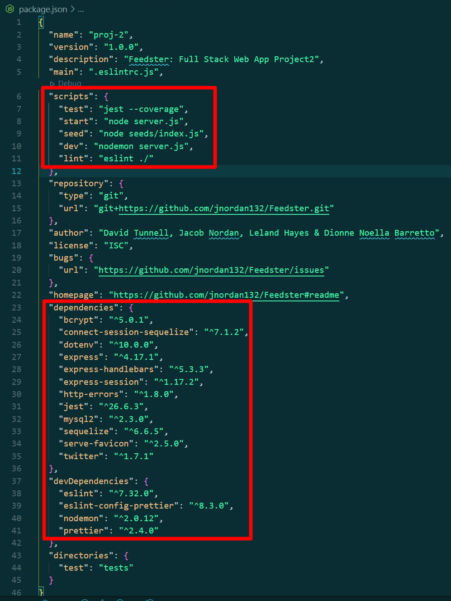 <br>
c. Update the `.env.EXAMPLE` file by editing your mysql username and password for the db; including twitter specifics as defined in *https://www.npmjs.com/package/twitter* <br>
d. Update the file name from `.env.EXAMPLE` to `.env` and ensure this file is in the root folder itself <br>
e. Connect to the mysql DB locally and source the `schema.sql;` file by running `source db/schema.sql;` command <br>
*Example:*<br> 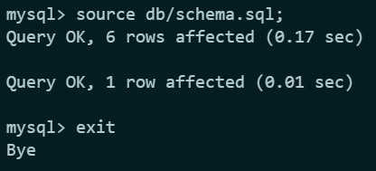 <br>
f. `exit` from the mysql connection to and `seed` the db by running `npm run seed` <br>
*Example:*<br> 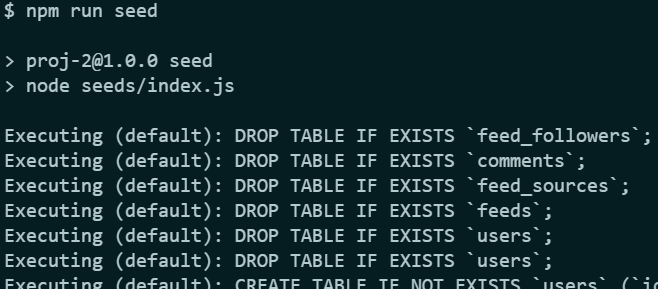 <br>
g. Optionally, you can run `node run test` for *Jest* - a javascript testing framework to kick off a series of quick tests (Dummy Tests) <br>
*Example:* <br>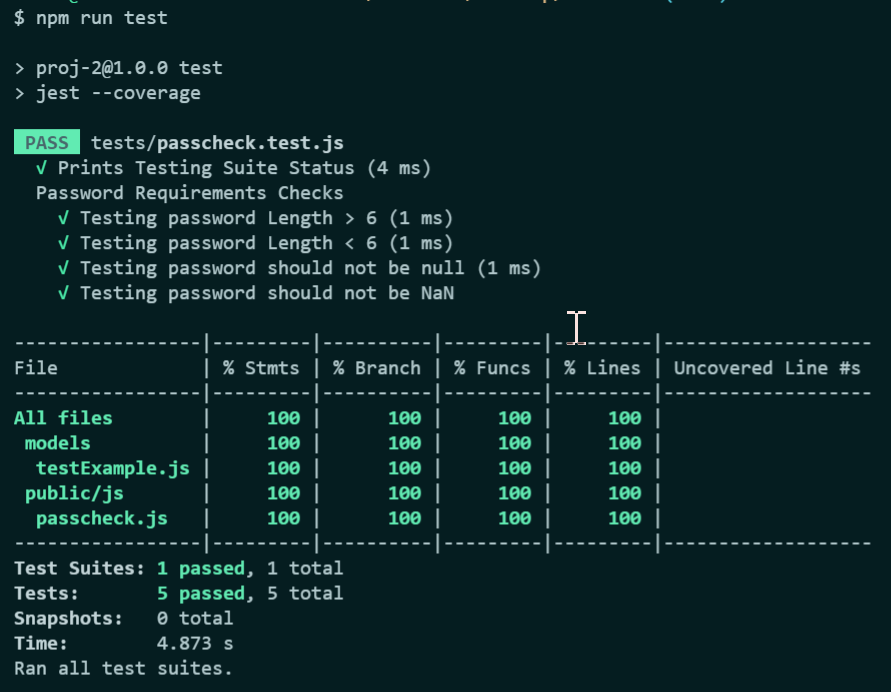 <br>
h.Finally, to run this application enter `node server.js` or `npm start` to be prompted with the `localhost/port#` url <br>
i.On the **Feedster** [landing page](https://feedster-twitter-feed.herokuapp.com/) you will be presented with User Feeds you can opt to follow after Signing/Logging in 
 <br>


## Project Future Enhancements
⏭️Giving the users the ability to follow other users and compare alike category cards with other users they follow <br/>
⏭️Pull feeds from all main social media platforms (Instagram, Facebook, LinkedIn, Youtube) to view with each category card<br/>
⏭️ Allow users to update/edit (Profile pictures, background, add bio, etc. . .) profile pages to their desire <br/>
⏭️Drill into feeds,followers, following from User's Profile Page <br/>
⏭️Improve Accessibility/Performance Scores<br/>
⏭️Integrate robust Testing functionality<br/>
⏭️Improve Client actionable Error Handling for @twitterhandle not found *Example: [{code: 34, message: 'Sorry, thatpage does not exist.'}]*
⏭️[Convert Alerts to Modals](https://kanecohen.github.io/modal-vanilla/)  <br/>
⏭️[Improve the comment input on the feed page to be text area](https://www.quackit.com/html/codes/comment_box_colors.cfm) <br/>


## Mock-Up (Screenshots & Responsive UI View)
**First Screen when web app loads:**  <br/>
**SignUp Page with Client-side input validation (not passing)** 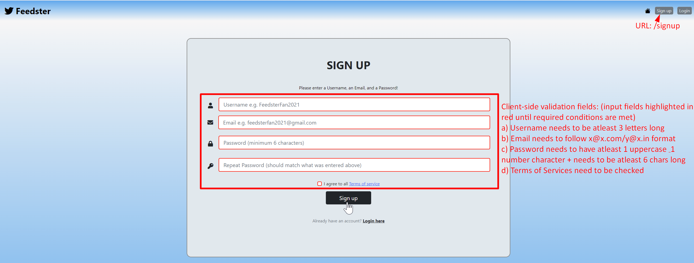 <br/>
**SignUp Page with Client-side input validation (passing)** 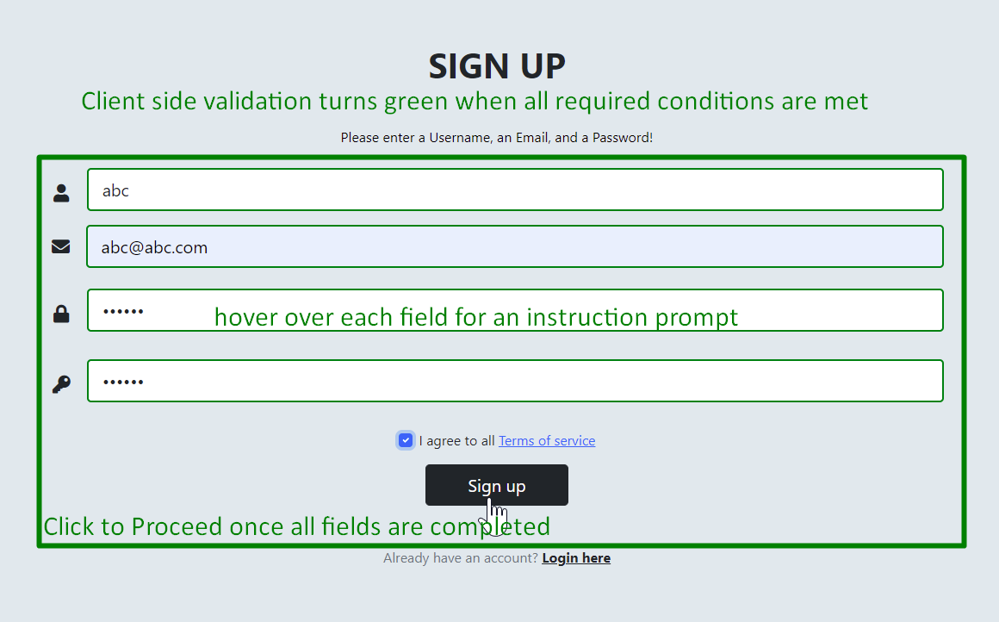 <br/>
**Feedster Terms of Service Page** 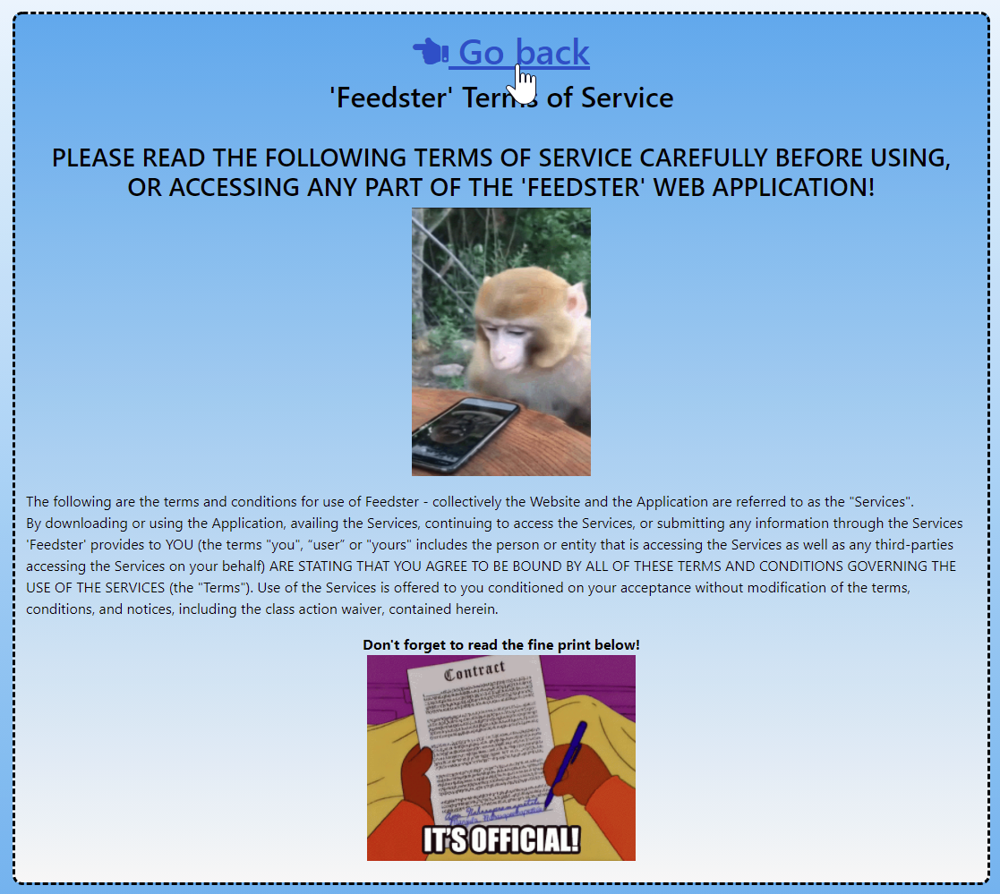 <br/>
**Login Page with Client-side input validation (unmet conditions)** 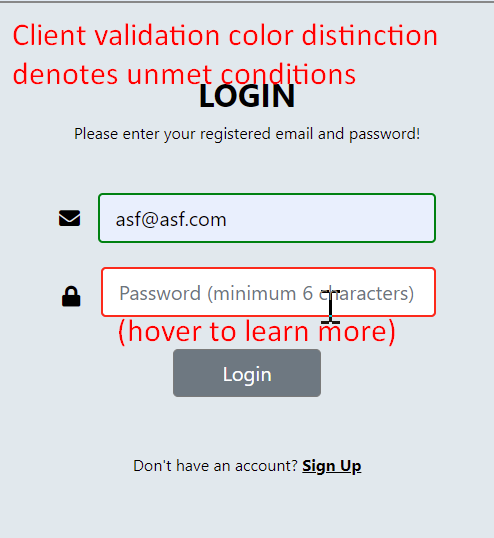 <br/>
<!-- **Form Input Reset to nirvana state:**  <br/> -->
**No Console Errors on Page Load (Right click for Inspect Element>Console tab)** <br/> 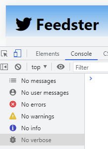 <br/>
**WrongURL Json Prompt:** 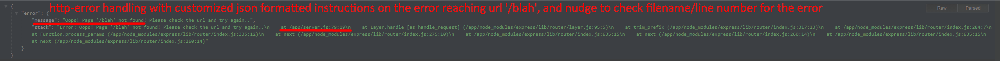 <br/>
**User Profile Page: (URL: /profile/id#)**  <br/>
**Add Feed : (URL: /profile/id#)** 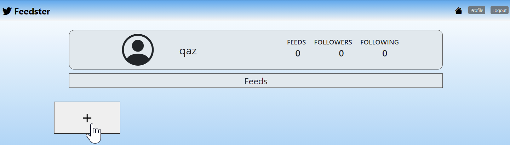 <br/>
**Add Feed Modal: (URL: /profile/id#)** 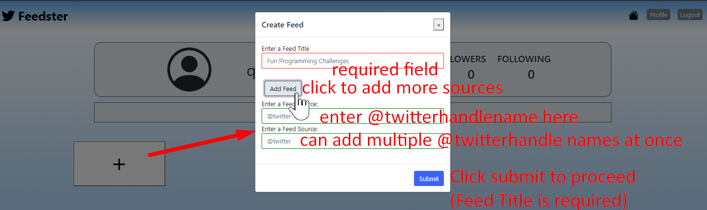 <br/>
**Feed Page (URL: /feed/id#):** 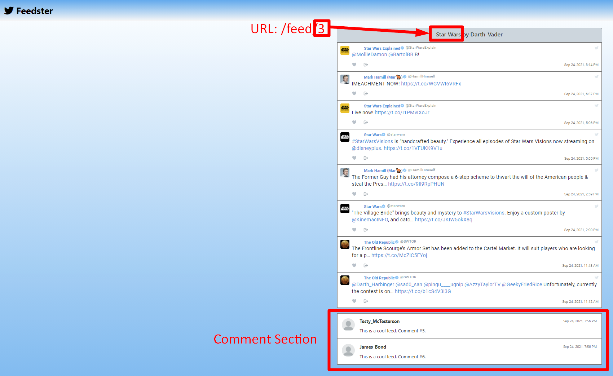 <br/>
**Log Out Prompt:** 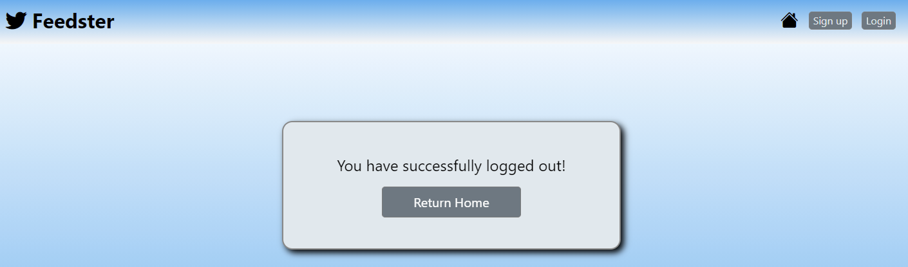 <br/>

## AccessibilityScores (LightHouseReports)
**Landing Page Score:** 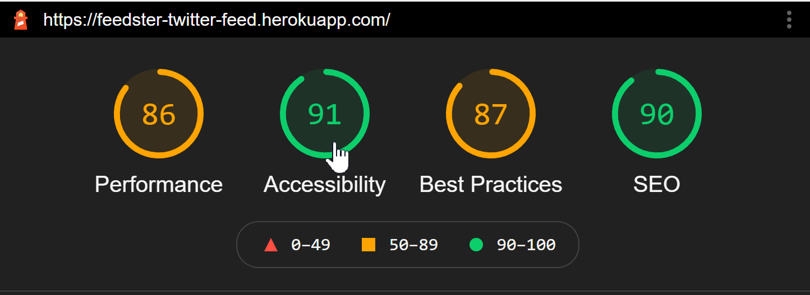 <br/>
**SignUp Page Score:** 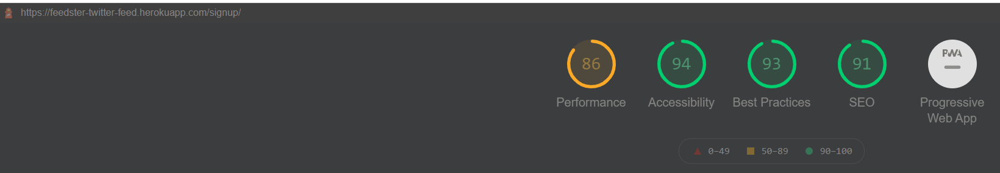 <br/>
**Terms Of Service Page Score:**  <br/>
**User Profile Page Score:** 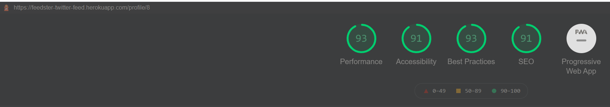 <br/>
**Feed Page  Score:**  <br/>
**Login Page Score:** 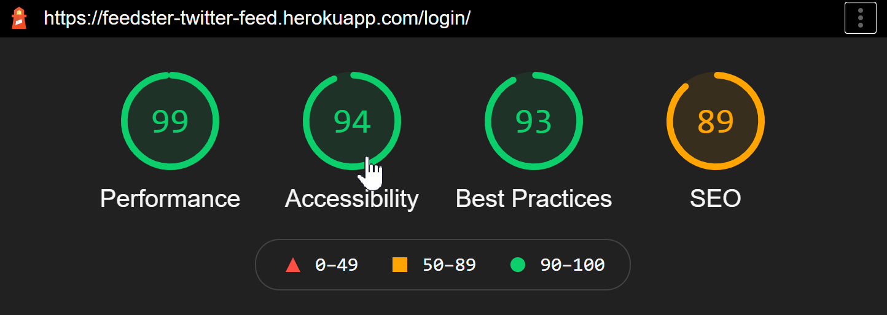 <br/>
**Log Out Score:** 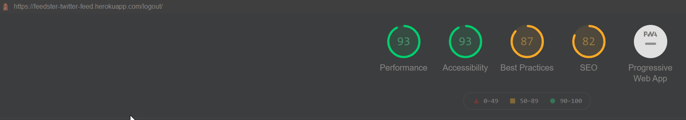 <br/>

## Presentation Requirements
```
Elevator pitch 🎤: a one minute description of your application
Concept 📖: What is your user story? What was your motivation for development?
Process ♻️: What were the technologies used? How were tasks and roles broken down and assigned? What challenges did you encounter? What were your successes?
Demo 💻: Show your stuff!
Directions for Future ⏭️ Development
Links 🔗: to the deployed application in Heroku and the GitHub repository
```


## Grading Requirements=

This project is graded based on the following criteria:

### Technical Acceptance Criteria: 25%
🏁 Satisfies the following code requirements:
```
✔️ Application uses a Node.js and Express.js back end and uses both GET and POST routes for retrieving and adding new data.
✔️ Application has a folder structure that meets the MVC paradigm and uses Handlebars.js as the template engine.
✔️ Application is backed by a MySQL database with a Sequelize ORM and protects API keys and sensitive information with environment variables.
✔️ Application includes user authentication (express-session and cookies).
✔️ Application uses at least one new library, package, or technology not covered in class.
```

### Concept 10%
```
✔️ Application should be a unique and novel idea 
✔️ Group should clearly and concisely articulate your project idea 
```

### Deployment: 20%
```
✔️ Application deployed at live URL on Heroku and loads with no errors.
✔️ Application GitHub URL submitted.
```

### Repository Quality: 10%
```
✔️ Repository has a unique name.
✔️ Repository follows best practices for file structure and naming conventions.
✔️ Repository follows best practices for class/id-naming conventions, indentation, quality comments, etc.
✔️ Repository contains multiple descriptive commit messages.
✔️ Repository contains quality README file with description, screenshot, and link to deployed application.
```

### Application Quality: 15%
```
✔️ Application user experience is intuitive and easy to navigate.
✔️ Application user interface style is clean and polished.
✔️ Application is responsive.
```

### Presentation 10%
```
✔️ Your group should present using Powerpoint or a similar presentation software.
✔️ Every group member should speak during the presentation.
✔️ Your presentation should follow the [Project Presentation Template](https://docs.google.com/presentation/d/10QaO9KH8HtUXj__81ve0SZcpO5DbMbqqQr4iPpbwKks/edit?usp=sharing).
```

### Collaboration 10%
```
✔️ There are no major disparities in the number of GitHub contributions between group members.
```
## How to Submit Your Interactive Full-Stack Project

**Each member of your group** is required to submit the following for review:
```
✔️ The URL of the deployed application.
✔️ The URL of the GitHub repository, with a unique name and a README describing the project.
```
