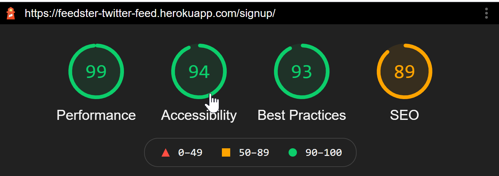
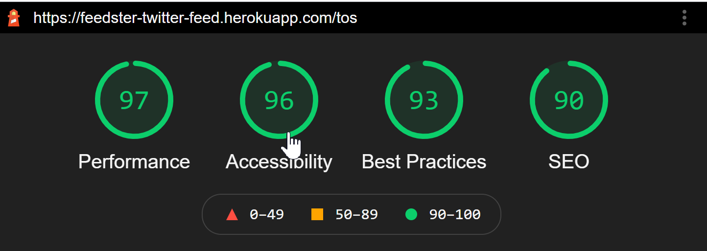
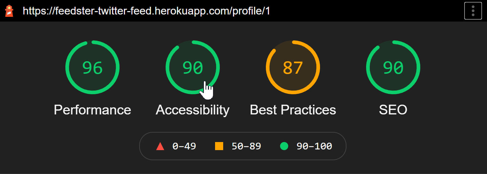
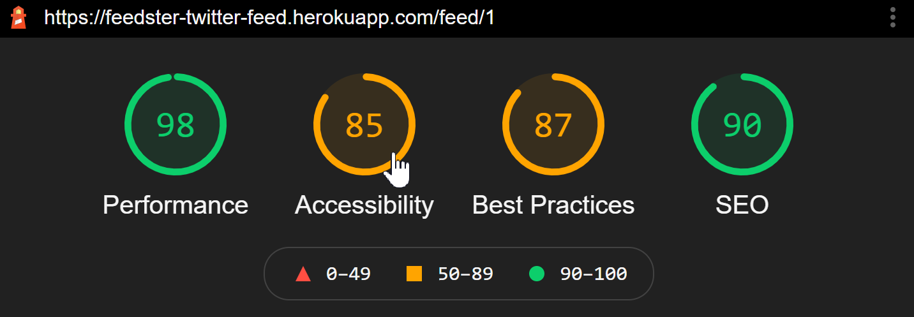

# 15 Project 2: Interactive Full-Stack Application
This repository is for group 8's Project2 - Interactive Full-Stack Application: 'Feedster'. The main purpose of this project to build a fullstack web application from scratch as a group. This app will execute a design that solves a real-world problem.

## Project Team Authors
<table>
<thead>
<tr>
<th><a href="https://github.com/DavidTunnell">David Tunnell</a></th>
<th><a href="https://github.com/jnordan132">Jacob Nordan</a></th>
<th><a href="https://github.com/ilelandhayes">Leland Hayes</a></th>
<th><a href="https://github.com/DionneNoellaBarretto">Dionne Noella Barretto</a></th>
</tr>
</thead>
<tbody>
<tr>
<td><a target="_blank" rel="noopener noreferrer" href="https://davidtunnell.github.io/my-web-portfolio/"></a></td>
<td><a target="_blank" rel="noopener noreferrer" href="https://jnordan132.github.io/Web-Portfolio-2/"></a></td>
<td><a target="_blank" rel="noopener noreferrer" href="https://ilelandhayes.github.io/Portfolio-Page/"></a></td>
<td><a target="_blank" rel="noopener noreferrer" href="https://dionnenoellabarretto.github.io/DionneNoellaBarretto_Portfolio/"></a></td>
</tr>
</tbody>
</table>

## Project Resources:
👉[Watch - Project App Demo]()<br/>
👉[Project Live URL (Heroku)](https://feedster-twitter-feed.herokuapp.com/)<br/>
👉[Project Wireframe/Plan/Proposal](https://docs.google.com/document/d/1UkL3EaRt6hdjlgQpQYlR67exUwjlNt862YEAd5OwlI8/edit#)<br/>
👉[Project Presentation Deck](https://docs.google.com/presentation/d/1mRIDBl0DP-tDFZV7GiqyeLykqNoXN9z3CVnP8862yow/edit?usp=sharing)<br/>
👉[Database Schema](./assets/database-schema.png)

## User Story
```
AS a user (for example: millennials and beyond or basically any one with an internet connected device) I 
WANT to subscribe to twitter feeds for a specific topic/category 
SO AS to view a mix of content on my account page that others can follow along to keep up with what I keep track of/like to read.
```

## Project Requirements

Apply everything we’ve learnt over the past six units to create a real-world full-stack application that we'll showcase to potential employers. Besides the user story and acceptance criteria our project fulfils the following requirements:
```
✔️ Use Node.js and Express.js to create a RESTful API.
✔️ Use Handlebars.js as the template engine.
✔️ Use MySQL and the Sequelize ORM for the database.
✔️ Have both GET and POST routes for retrieving and adding new data.
✔️ Use at least one new library, package, or technology that we haven’t discussed.
✔️ Have a folder structure that meets the MVC paradigm.
✔️ Include authentication (express-session and cookies).
✔️ Protect API keys and sensitive information with environment variables.
✔️ Be deployed using Heroku (with data).
✔️ Have a polished UI.
✔️ Be responsive.
✔️ Be interactive (i.e., accept and respond to user input).
✔️ Meet good-quality coding standards (file structure, naming conventions, follows best practices for class/id naming conventions, indentation, quality comments, etc.).
✔️ Have a professional README (with unique name, description, technologies used, screenshot, and link to deployed application).
```

## Technology Used in this Project
**Accessibility Testing:** <a href="https://github.com/GoogleChrome/lighthouse" target="_blank">  </a>  <br>
**IDE/OS:**    <br>
**Cloud Hosting:**   <br>
**Frontend:**    <br>
**Backend:**  <br>
**Database:**  <br>
**Frameworks:**        <br>
**Linters:**   <br>
**Social Media:**  <br>
**Communication:**   


## App Usage/ Installation Instructions: 
To use **Feedster** web interface:

a. Clone this repository to your local system <br>
b. Run `npm install` or `npm i` in order to install the npm package dependencies as specified in the `package.json` file  <br>
c. Update the `.env.EXAMPLE` file by editing your mysql username and password for the db; including twitter specifics as defined in *https://www.npmjs.com/package/twitter* <br>
d. Update the file name from `.env.EXAMPLE` to `.env` and ensure this file is in the root folder itself <br>
e. Connect to the mysql DB locally and source the `schema.sql;` file by running `source db/schema.sql;` command <br>
*Example:*<br>  <br>
f. `exit` from the mysql connection to and `seed` the db by running `npm run seed` <br>
*Example:*<br>  <br>
g. Optionally, you can run `node run test` for *Jest* - a javascript testing framework to kick off a series of quick tests <br>
*Example:* <br> <br>
h.Finally, to run this application enter `node server.js` or `npm start` to be prompted with the `localhost/port#` url <br>


## Project Future Enhancements
⏭️More Social Media API Support/Integration <br/>
⏭️Drill into feeds,followers, following from User's Profile Page <br/>
⏭️Improve Accessibility/Performance Scores<br/>
⏭️Increased Testing functionality integrated <br/>
⏭️[Convert Alerts to Modals](https://kanecohen.github.io/modal-vanilla/)  <br/>
⏭️[Improve the comment input on the feed page to be text area](https://www.quackit.com/html/codes/comment_box_colors.cfm) <br/>


## Mock-Up (Screenshots & Responsive UI View)
**First Screen when web app loads:**  <br/>
**SignUp Page with Client-side input validation (not passing)**  <br/>
**SignUp Page with Client-side input validation (passing)**  <br/>
**Feedster Terms of Service Page**  <br/>
**Login Page with Client-side input validation (unmet conditions)**  <br/>
<!-- **Form Input Reset to nirvana state:**  <br/> -->
**No Console Errors on Page Load (Browser -Right click for Inspect Element>Navigate to Console tab)**  <br/>
**WrongURL Json Prompt:**  <br/>
**User Profile Page: (URL: /profile/id#)**  <br/>
**Feed Page (URL: /feed/id#):**  <br/>

**Log Out Prompt:**  <br/>

## AccessibilityScores (LightHouseReports)
**Landing Page Score:**  <br/>
**SignUp Page Score:**  <br/>
**Terms Of Service Page Score:**  <br/>
**User Profile Page Score:**  <br/>
**Feed Page  Score:**  <br/>
**Login Page Score:**  <br/>
**Log Out Score:**  <br/>

## Presentation Requirements
```
Elevator pitch 🎤: a one minute description of your application
Concept 📖: What is your user story? What was your motivation for development?
Process ♻️: What were the technologies used? How were tasks and roles broken down and assigned? What challenges did you encounter? What were your successes?
Demo 💻: Show your stuff!
Directions for Future ⏭️ Development
Links 🔗: to the deployed application in Heroku and the GitHub repository
```


## Grading Requirements=

This project is graded based on the following criteria:

### Technical Acceptance Criteria: 25%
🏁 Satisfies the following code requirements:
```
✔️ Application uses a Node.js and Express.js back end and uses both GET and POST routes for retrieving and adding new data.
✔️ Application has a folder structure that meets the MVC paradigm and uses Handlebars.js as the template engine.
✔️ Application is backed by a MySQL database with a Sequelize ORM and protects API keys and sensitive information with environment variables.
✔️ Application includes user authentication (express-session and cookies).
✔️ Application uses at least one new library, package, or technology not covered in class.
```

### Concept 10%
```
✔️ Application should be a unique and novel idea 
✔️ Group should clearly and concisely articulate your project idea 
```

### Deployment: 20%
```
✔️ Application deployed at live URL on Heroku and loads with no errors.
✔️ Application GitHub URL submitted.
```

### Repository Quality: 10%
```
✔️ Repository has a unique name.
✔️ Repository follows best practices for file structure and naming conventions.
✔️ Repository follows best practices for class/id-naming conventions, indentation, quality comments, etc.
✔️ Repository contains multiple descriptive commit messages.
✔️ Repository contains quality README file with description, screenshot, and link to deployed application.
```

### Application Quality: 15%
```
✔️ Application user experience is intuitive and easy to navigate.
✔️ Application user interface style is clean and polished.
✔️ Application is responsive.
```

### Presentation 10%
```
✔️ Your group should present using Powerpoint or a similar presentation software.
✔️ Every group member should speak during the presentation.
✔️ Your presentation should follow the [Project Presentation Template](https://docs.google.com/presentation/d/10QaO9KH8HtUXj__81ve0SZcpO5DbMbqqQr4iPpbwKks/edit?usp=sharing).
```

### Collaboration 10%
```
✔️ There are no major disparities in the number of GitHub contributions between group members.
```
## How to Submit Your Interactive Full-Stack Project

**Each member of your group** is required to submit the following for review:
```
✔️ The URL of the deployed application.
✔️ The URL of the GitHub repository, with a unique name and a README describing the project.
```
